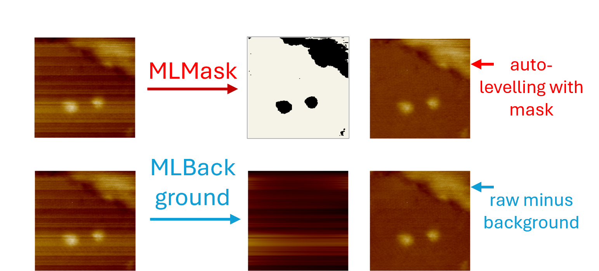

# afMLevel: AFM Machine Learning Levelling


## **Overview**

A python package for running two separate models for automatic levelling of AFM images: MLMask and MLBackground. The functions provided are:

* **ml_background():** MLBackground U-Net model
* **ml_mask():** MLMask U-Net model
* **level_ml\_mask():** function for levelling with MLMask


MLBackground detects the noise background and subtracts this from the raw image to give the levelled image (input: raw AFM image, output: levelled image or background). 

MLMask detects the image features and produces a binary segmentation map of the features (input: raw image, output: binary mask). 

Level MLMask uses MLMask within auto-levelling routines as an alternative to generating the mask by thresholding (e.g. by Otsu’s method, using n\*standard deviation or using a fixed value). The routines available for use with MLMask are:

* MLMask 
* iterative MLMask 
* multi-plane MLMask
* multi-plane MLMask + line



Jupyter notebooks are provided to demonstrate using each model.


## **Quick-start guide**

### Create new python environment

In powershell:

```python
conda create -n afmlevelenv python=3.11
conda activate afmlevelenv
```

### Create a new folder and download afmlevel files into this

#### Download python files containing the main functions and dependencies

* utils.py
* unet.py
* mask_model.py
* background_model.py

#### Download model paths

**The model paths are available via the link below:**

https://leeds365-my.sharepoint.com/:f:/g/personal/pymte_leeds_ac_uk/IgCh5DkBDFHvT5biEQX697Z1AU6F9GHF29ZBatKf_COdTlg?e=3QhYPp

* MaskModel.pth
* BGModel.pth


#### If using demo: Download demo notebooks 

* notebooks folder


#### If using demo: Download example data 

* TestImage folder

(note: own data can be used within the notebooks if it is saved in the same format as the example data (tiff))


### Run models 

#### If using demo: Open Jupyter Notebook

In powershell (within afmlevelenv):

```python

cd \\path\\to\\afmlevelfolder

jupyter notebook
```


Navigate to notebook and follow the instructions within. Options: 

* single-image-demo.ipynb
* movie-demo.ipynb


All functions take a NumPy array as the input (2D - single image; 3D - movie stack) and output the result as a NumPy array. AFM files can be converted to np arrays via existing software such as afmreader. The demo notebooks also give an example of converting from AFM files or tiffs to np arrays. 


